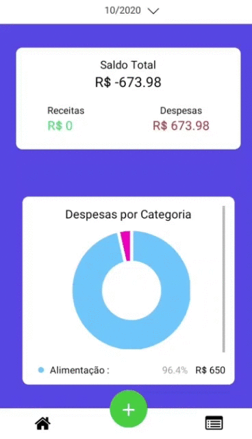
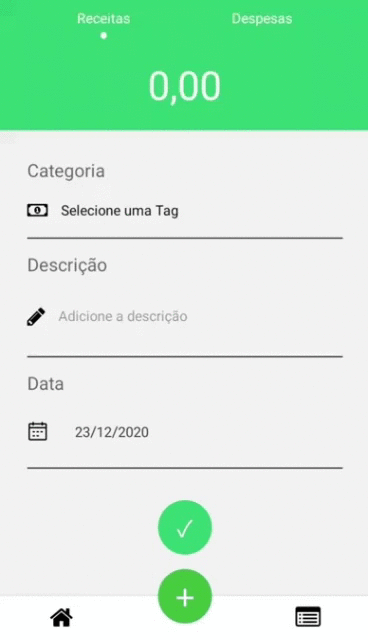

<h1 align="center">
    💲 Controle Financeiro
</h1>

    
    

## Sobre

Aplicação que controla os gastos diários por meio de registros de transações do usuário , onde são separados por data , tipo e valor . O app fornece gráficos para o melhor entendimento do volume de dados .

## Tecnologias

- ✔️ React Native
- ✔️ Context API
- ✔️ React Hooks
- ✔️ React Native Date Picker
- ✔️ React Native SVG Charts
- ✔️ React Native Vector Icons